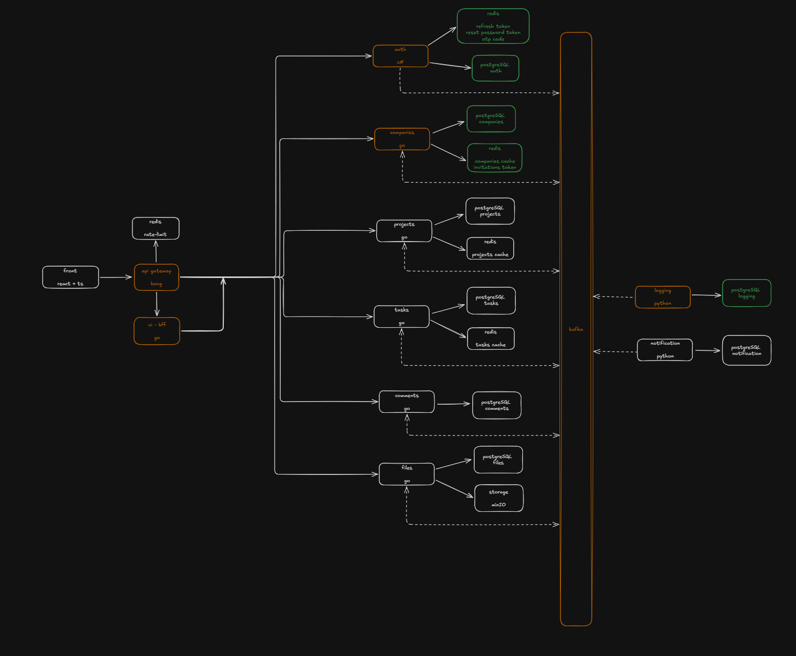

# Galaxy

Galaxy — микросервисная система для планирования задач и управления проектами.

Проект находится в активной разработке. В текущем состоянии репозиторий содержит полностью функциональную микросервисную архитектуру с сервисом авторизации (C#), BFF-слоем (Go), сервисом управления компаниями (Go), сервисом управления файлами (Go) с интеграцией MinIO, сервисом логирования (Python), API Gateway Kong, обменом событиями через Kafka, кэшированием данных в Redis и основным хранилищем в PostgreSQL. Доменные сущности для проектов, задач, комментариев, файлов и уведомлений уже описаны в SQL-инициализации базы данных, отдельные сервисы для этих областей находятся в разработке.

## Назначение проекта

Galaxy разрабатывается как полнофункциональная микросервисная система планирования задач.

### Ключевые возможности:

- 👤 **Управление пользователями**: регистрация, авторизация, двухфакторная аутентификация (OTP), восстановление пароля;
- 🏢 **Управление компаниями**: создание компаний, управление участниками, ролями и правами доступа;
- 📁 **Управление файлами**: загрузка, скачивание, управление метаданными с использованием MinIO (S3);
- 📊 **Управление проектами**: распределение проектов по компаниям, управление участниками и правами (в разработке);
- ✅ **Управление задачами**: создание, назначение, отслеживание статуса задач (в разработке);
- 💬 **Комментарии и обсуждения**: комментирование задач с поддержкой вложений;
- 🔔 **Уведомления**: система оповещения пользователей о событиях (в разработке);
- 📝 **Аудит событий**: логирование всех значимых действий через Kafka.

### Архитектурные преимущества:

- **Микросервисная архитектура** — независимые сервисы, масштабируемость;
- **Event-Driven** — асинхронный обмен через Kafka, слабая связанность;
- **API Gateway** — единая точка входа через Kong с маршрутизацией и плагинами;
- **Масштабируемость** — легко добавлять новые сервисы и функциональность;
- **Надежность** — outbox pattern для гарантированной доставки событий, health checks, автоперезагрузка контейнеров.

## Текущее состояние

### Реализовано:

- ✅ `auth-service` — полнофункциональный сервис авторизации на C# с JWT, OTP, password reset;
- ✅ `bff-service` — BFF-слой на Go для агрегации данных;
- ✅ `companies-service` — управление компаниями, ролями, участниками и правами доступа на Go;
- ✅ `files-service` — управление файлами с интеграцией MinIO (S3-совместимое хранилище) на Go;
- ✅ `logging-service` — обработка и логирование событий Kafka на Python;
- ✅ `kong` — полная конфигурация API Gateway с маршрутизацией и плагинами;
- ✅ `docker-compose.yml` — однокомандный запуск всей системы и инфраструктуры;
- ✅ `init.sql` — полная инициализация PostgreSQL с доменными таблицами;
- ✅ `architecture.excalidraw` — детальная диаграмма архитектуры;
- ✅ `.gitlab-ci.yml` — настроенный CI/CD pipeline.

### В разработке / запланировано:

- ⏳ `projects-service` — сервис управления проектами;
- ⏳ `tasks-service` — сервис управления задачами;
- ⏳ `notification-service` — сервис уведомлений;
- ⏳ `frontend` — клиентское приложение на React + TypeScript;
- ⏳ Расширенная валидация и error handling;
- ⏳ Unit и интеграционные тесты для всех сервисов.

## Архитектура

Проект построен как набор независимых сервисов, взаимодействующих через HTTP и Kafka.

### Основные компоненты:

| Компонент           | Назначение                                                          |
| ------------------- | ------------------------------------------------------------------- |
| `kong`              | API Gateway. Маршрутизация внешних запросов к внутренним сервисам.  |
| `bff-service`       | Backend for Frontend. Агрегация данных из других сервисов.          |
| `auth-service`      | Авторизация, регистрация, JWT, refresh token, password reset, OTP.  |
| `companies-service` | Управление компаниями, ролями, участниками и правами доступа.       |
| `files-service`     | Управление файлами с интеграцией MinIO (S3).                        |
| `logging-service`   | Обработка событий из Kafka и логирование.                           |
| `postgres`          | Основная база данных приложения.                                    |
| `auth-redis`        | Redis для данных авторизации.                                       |
| `companies-redis`   | Redis для кэша сервиса компаний.                                    |
| `kafka`             | Kafka-брокер для событийного обмена между сервисами.                |
| `minio`             | S3-совместимое объектное хранилище для физического хранения файлов. |

### Схема взаимодействия:



## Технологический стек

| Область            | Технологии             |
| ------------------ | ---------------------- |
| API Gateway        | Kong Gateway           |
| BFF                | Go                     |
| Сервис компаний    | Go                     |
| Сервис файлов      | Go                     |
| Сервис авторизации | C# ASP.NET Core        |
| Сервис логирования | Python                 |
| Основная БД        | PostgreSQL             |
| Кэш / сессии       | Redis                  |
| Event Streaming    | Apache Kafka           |
| S3-хранилище       | MinIO latest           |
| Контейнеризация    | Docker, Docker Compose |

## Требования

Для запуска проекта необходимы:

- Docker;
- Docker Compose;
- Git для клонирования репозитория;
- клиент для подключения к PostgreSQL.

## Структура репозитория

```text
.
├── auth-service/            # Сервис авторизации (C#, ASP.NET Core)
│   ├── Controllers/         # HTTP контроллеры (Login, Register, Profile, etc.)
│   ├── Services/            # Бизнес-логика (Auth, Account, OTP, etc.)
│   ├── Repositories/        # Доступ к данным
│   ├── Infrastructure/      # JWT, Redis, Middleware, Security
│   ├── Config/              # Конфигурация приложения
│   ├── DTO/                 # Data Transfer Objects
│   └── Dockerfile
│
├── bff-service/             # Backend for Frontend (Go)
│   ├── cmd/                 # Точка входа приложения
│   ├── internal/
│   │   ├── api/             # HTTP обработчики
│   │   ├── service/         # Бизнес-логика
│   │   ├── app/             # Инициализация приложения
│   │   ├── clients/         # Клиенты для других сервисов
│   │   └── dto/             # Data Transfer Objects
│   ├── pkg/                 # Общие утилиты, middleware
│   └── Dockerfile
│
├── companies-service/       # Сервис управления компаниями (Go)
│   ├── cmd/                 # Точка входа
│   ├── internal/
│   │   ├── api/             # HTTP обработчики
│   │   ├── repository/      # Доступ к данным (PostgreSQL)
│   │   ├── service/         # Бизнес-логика
│   │   ├── permissions/     # Управление правами доступа
│   │   ├── dto/             # Data Transfer Objects
│   │   └── app/             # Инициализация
│   ├── pkg/                 # Общие утилиты, middleware
│   └── Dockerfile
│
├── files-service/           # Сервис управления файлами (Go)
│   ├── cmd/                 # Точка входа
│   ├── internal/
│   │   ├── api/             # HTTP обработчики
│   │   ├── repository/      # Доступ к данным
│   │   ├── service/         # Бизнес-логика (S3, DB, etc.)
│   │   ├── dto/             # Data Transfer Objects
│   │   └── app/             # Инициализация
│   ├── pkg/                 # S3 клиент, middleware, utils
│   └── Dockerfile
│
├── logging-service/         # Сервис логирования (Python)
│   ├── src/                 # Исходный код
│   ├── Dockerfile
│   └── requirements.txt
│
├── kong/                    # API Gateway конфигурация
│   ├── kong.yml             # Declarative конфигурация Kong
│   ├── plugins/             # Custom Lua плагины
│   │   └── account-uuid-header/  # Плагин для добавления UUID в заголовки
│   ├── docker-compose.yml
│   └── Dockerfile
│
├── infra/                   # Конфигурации инфраструктуры (CI/CD)
│   ├── .env.ci              # Переменные для CI/CD
│   ├── docker-compose.kafka.yml
│   ├── docker-compose.minio.yml
│   ├── docker-compose.postgres.yml
│   └── docker-compose.redis.yml
│
├── docs/                    # Документация и диаграммы
│   └── image.png            # Диаграмма архитектуры системы
│
├── .github/                 # GitHub Actions
├── .gitlab-ci.yml           # GitLab CI/CD конфигурация
├── docker-compose.yml       # Main compose файл (включает все сервисы)
├── init.sql                 # SQL инициализация PostgreSQL
├── architecture.excalidraw  # Диаграмма архитектуры (Excalidraw)
├── .env.example             # Пример переменных окружения
├── .gitignore               # Git ignore правила
└── README.md
```

## Переменные окружения

Перед запуском необходимо создать файл `.env` в корне каждого сервиса. Пример конфигурации находится в `.env.example`.

**⚠️ Важно:**

- Для production-окружения используйте сильные пароли (минимум 20+ символов)
- Никогда не коммитьте реальные пароли в репозиторий
- Используйте secret management сервисы для production

## Запуск проекта

### Быстрый старт (5 минут)

1. **Клонировать репозиторий**:

   ```bash
   git clone https://github.com/nomadxx404/galaxy.git
   cd galaxy
   ```

2. **Настроить переменные окружения**:

   ```bash
   cp .env.example .env
   ```

   При необходимости отредактируйте `.env` под свое окружение.

3. **Запустить все сервисы**:

   ```bash
   docker compose up --build
   ```

   Первый запуск займет 2-3 минуты (загрузка образов, инициализация БД).

4. **Проверить статус**:
   ```bash
   docker compose ps
   ```
   Все сервисы должны быть в статусе `Up (healthy)` через 1-2 минуты.

### Первые шаги после запуска

**Просмотр API документации** (Scalar/OpenAPI):

- Auth Service: http://localhost:8000/auth/scalar
- Companies Service: http://localhost:8000/companies/scalar
- Files Service: http://localhost:8000/files/scalar
- BFF/UI: http://localhost:8000/ui/scalar

**Мониторинг событий**:

- Kafka UI: http://localhost:8085

**Управление файлами**:

- MinIO Console: http://localhost:9001 (minioadmin / пароль из .env)

### Остановка проекта

```bash
docker compose down
```

## Доступные сервисы и порты

| Сервис           | URL / Порт                             | Назначение                       |
| ---------------- | -------------------------------------- | -------------------------------- |
| Kong Gateway     | http://localhost:8000                  | API Gateway (единая точка входа) |
| Auth Scalar      | http://localhost:8000/auth/scalar      | API документация авторизации     |
| Companies Scalar | http://localhost:8000/companies/scalar | API документация компаний        |
| Files Scalar     | http://localhost:8000/files/scalar     | API документация файлов          |
| BFF Scalar       | http://localhost:8000/ui/scalar        | API документация BFF             |
| Kafka            | localhost:9092                         | Kafka broker                     |
| Kafka UI         | http://localhost:8085                  | Web UI для Kafka                 |
| PostgreSQL       | localhost:5430                         | Основная база данных             |
| Redis Auth       | localhost:6380                         | Redis для авторизации            |
| Redis Companies  | localhost:6381                         | Redis для компаний               |
| MinIO S3         | localhost:9000                         | S3-хранилище                     |
| MinIO UI         | http://localhost:9001                  | Web UI MinIO                     |

## База данных

Основная БД инициализируется файлом `init.sql` при первом запуске контейнера PostgreSQL.

### Создаваемые схемы PostgreSQL:

- `auth` — аккаунты, outbox-события;
- `company` — компании, роли, участники, права доступа, outbox-события;
- `project` — проекты, роли участников, права доступа проектов;
- `task` — задачи, статусы, теги, приоритеты, исполнители;
- `comment` — комментарии к задачам и вложенные файлы;
- `file` — метаданные файлов, история использования;
- `notification` — уведомления пользователей.

### Подключение к БД:

```
Host: localhost
Port: 5430
Database: galaxy
User: postgres
Password: (из переменной POSTGRES_PASSWORD в .env)
```

Используйте любой SQL-клиент (psql, DBeaver, DataGrip, pgAdmin).

## Событийная архитектура

Проект использует Kafka для асинхронного обмена событиями между сервисами.

### Используемые Kafka топики:

- `auth-events` — регистрация, вход, выход, смена пароля пользователей;
- `company-events` — создание/обновление компании, добавление участников;
- `file-events` — загрузка, удаление, обновление файлов.

### Обработка событий (Outbox Pattern):

1. Сервис записывает событие в локальную `outbox` таблицу в рамках той же транзакции с бизнес-данными
2. Отдельный процесс читает события из `outbox` и публикует их в Kafka
3. `logging-service` и другие сервисы подписаны на Kafka топики
4. События обрабатываются асинхронно

**Результат:** Гарантия доставки событий, предотвращение потери данных, слабая связанность сервисов.

## Roadmap

### ✅ Завершено:

- Микросервисная архитектура с Docker Compose
- Сервис авторизации с JWT, OTP, password reset
- API Gateway (Kong) с маршрутизацией
- Управление компаниями и правами доступа
- Управление файлами с MinIO (S3)
- Event streaming через Kafka
- Логирование событий

### ⏳ Планируется:

- Создание `projects-service` (управление проектами)
- Создание `tasks-service` (управление задачами и исполнителями)
- Создание `notification-service` (уведомления пользователям)
- Frontend приложение (React + TypeScript)
- Расширенная OpenAPI-документация
- Unit и интеграционные тесты
- CI/CD pipeline (GitLab CI)
- Production-конфигурация с Kubernetes / Helm
- Monitoring & Alerting (Prometheus, Grafana)
- API Rate Limiting и caching strategies

## Лицензия

MIT
